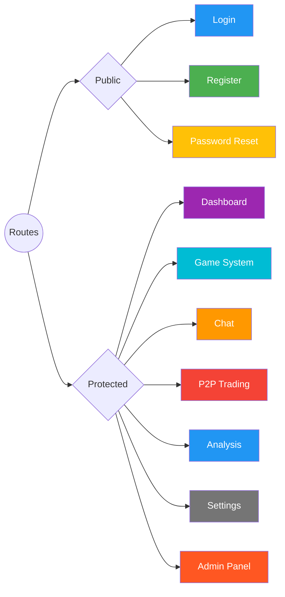
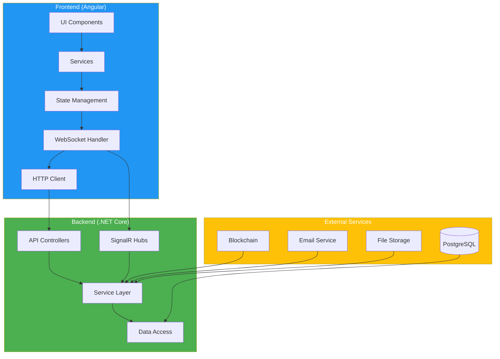
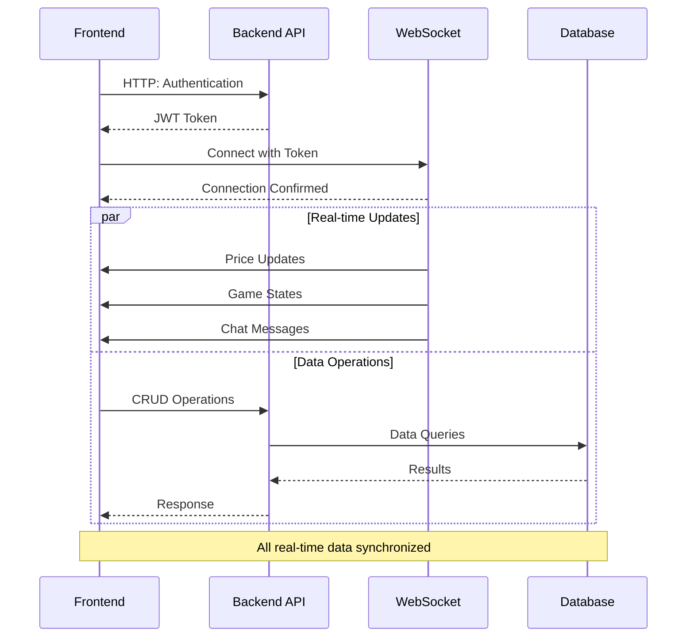

# Nền Tảng DATK: Hệ Thống Giao Dịch & Trò Chuyện Thời Gian Thực

## 1. Tổng Quan

DATK Platform là một ứng dụng full-stack được phát triển với mục tiêu tạo ra trải nghiệm tương tác thời gian thực cho người dùng. Hệ thống tích hợp game đặt cược dựa trên tiền điện tử, nền tảng nhắn tin đa năng, ghi nhận sự kiện blockchain và phân tích giao dịch nâng cao. Kiến trúc được xây dựng dựa trên backend .NET theo hướng service-oriented và frontend Angular (SPA), với trọng tâm là giao tiếp thời gian thực qua WebSocket và các chiến lược giao dịch tự động.

## 2. Kiến Trúc Hệ Thống

Ứng dụng được xây dựng theo mô hình client-server tách biệt, đảm bảo sự phân chia rõ ràng giữa tầng giao diện người dùng (frontend) và tầng xử lý logic nghiệp vụ (backend).

### 2.1. Kiến Trúc Backend

Backend được xây dựng dựa trên ASP.NET Core theo kiến trúc đa tầng, hướng dịch vụ.

- **Tầng API**: Bao gồm các controllers RESTful (`Controllers/`) cung cấp các điểm cuối HTTP cho tất cả các thao tác CRUD và hành động của người dùng (ví dụ: đặt cược, gửi tin nhắn).
- **Tầng Dịch Vụ**: Logic nghiệp vụ cốt lõi được đóng gói trong các services (`Services/`). Tầng này chịu trách nhiệm điều phối dữ liệu từ nhiều nguồn, thực hiện tính toán và xử lý logic cho các tính năng như quản lý phiên game, xác thực người dùng và vận hành chat.
- **Tầng Truy Cập Dữ Liệu**: Quản lý dữ liệu thông qua Entity Framework Core, với `TradeFinanceDbContext` (`Data/`) định nghĩa ánh xạ đối tượng-quan hệ đến cơ sở dữ liệu PostgreSQL. Context này bao gồm tất cả các entities, từ mô hình người dùng đến nhật ký game và giao dịch.
- **Hệ Thống Thời Gian Thực**: Các hub SignalR (`Hubs/`) cung cấp nền tảng giao tiếp thời gian thực. Các hub chính bao gồm:
    - `GameHub`: Phát sóng thay đổi trạng thái game, cập nhật giá và kết quả vòng chơi đến tất cả người dùng.
    - `ChatHub`: Quản lý tin nhắn thời gian thực, hiện diện người dùng và chỉ báo đang nhập.
    - `PresenceHub`: Theo dõi trạng thái trực tuyến của người dùng trong toàn bộ ứng dụng.
- **Dịch Vụ Nền**: Hệ thống sử dụng các triển khai `IHostedService` cho các tác vụ nền dài hạn, bao gồm `GameSessionManagementService` (điều khiển vòng game), `PMCoinBotService` (mô phỏng biến động thị trường) và `DailyAnalysisScheduler` (thông báo định kỳ).

### 2.2. Kiến Trúc Frontend

Frontend được xây dựng bằng Angular SPA hiện đại, được thiết kế để tạo trải nghiệm người dùng động và phản ứng nhanh.

- **Giao Diện Dựa Trên Components**: UI được xây dựng từ cây các components Angular module hóa (`features/` và `shared/`), tăng khả năng tái sử dụng và bảo trì.
- **Quản Lý Trạng Thái Reactive**: Sử dụng RxJS để quản lý luồng dữ liệu bất đồng bộ từ backend, xử lý đầu vào người dùng và duy trì trạng thái UI.
- **Tầng Dịch Vụ**: Các services Angular (`core/services/`) đảm nhiệm việc đóng gói mọi giao tiếp với backend. Bao gồm thực hiện các yêu cầu HTTP đến REST API và quản lý kết nối SignalR liên tục.
- **Định Tuyến**: Ứng dụng sử dụng module định tuyến theo tính năng (`app.routes.ts`) với các route guards (`AuthGuard`, `AdminGuard`) để bảo vệ các phần của ứng dụng dựa trên trạng thái xác thực và ủy quyền người dùng.
- **Tương Tác Blockchain**: Frontend sử dụng thư viện `ethers.js` để tương tác trực tiếp với ví người dùng (như MetaMask) để ký giao dịch hoặc tin nhắn, tạo cầu nối cho các hoạt động blockchain phía client.

### 2.3. Application Routes and API Endpoints

#### 🌐 Client Routes



#### 📍 Chi Tiết Các Đường Dẫn

| Đường dẫn | Quyền truy cập | Tính năng |
|-------|---------|----------|
| `/login` | Công khai | - Xác thực người dùng<br>- Khôi phục mật khẩu<br>- Hỗ trợ 2FA |
| `/register` | Công khai | - Tạo tài khoản<br>- Xác minh email<br>- Chấp nhận điều khoản |
| `/dashboard` | Bảo vệ | - Thống kê tổng quan<br>- Thao tác nhanh<br>- Thông báo |
| `/game` | Bảo vệ | - Giao dịch trực tiếp<br>- Phòng chơi game<br>- Bảng xếp hạng |
| `/chat` | Bảo vệ | - Tin nhắn trực tiếp<br>- Trò chuyện nhóm<br>- Chia sẻ tệp |
| `/p2p` | Bảo vệ | - Sổ lệnh<br>- Lịch sử giao dịch<br>- Thống kê thị trường |
| `/analysis` | Bảo vệ | - Phân tích thị trường<br>- Chỉ số hiệu suất<br>- Báo cáo |
| `/settings` | Bảo vệ | - Cài đặt hồ sơ<br>- Tùy chọn bảo mật<br>- Tùy chỉnh |
| `/admin` | Quản trị | - Quản lý người dùng<br>- Giám sát hệ thống<br>- Cấu hình |

#### 🔌 API Endpoints Overview

| Category | Endpoint | Method | Description | Auth Required | 
|:--------:|----------|--------|-------------|:------------:|
| 🔐 **Authentication** |
| | `/api/auth/login` | POST | User login | ❌ |
| | `/api/auth/register` | POST | New user registration | ❌ |
| | `/api/auth/refresh-token` | POST | Refresh JWT token | ✅ |
| 👤 **User Management** |
| | `/api/users/profile` | GET | Get user profile | ✅ |
| | `/api/users/profile` | PUT | Update profile | ✅ |
| | `/api/users/balance` | GET | Get user balance | ✅ |
| 🎮 **Game System** |
| | `/api/game/session` | GET | Current game session | ✅ |
| | `/api/game/bet` | POST | Place a bet | ✅ |
| | `/api/game/history` | GET | Game history | ✅ |
| 💬 **Chat System** |
| | `/api/chat/conversations` | GET | List conversations | ✅ |
| | `/api/chat/messages` | POST | Send message | ✅ |
| | `/api/chat/messages/{id}` | DELETE | Delete message | ✅ |
| 📈 **Trading & Analysis** |
| | `/api/p2p/price` | GET | Current PM coin price | ✅ |
| | `/api/p2p/orders` | POST | Create trade order | ✅ |
| | `/api/analysis/daily` | GET | Daily analysis | ✅ |
| 📂 **File Management** |
| | `/api/files/upload` | POST | Upload file | ✅ |
| | `/api/files/{id}` | GET | Get file | ✅ |
| ⚙️ **System Administration** |
| | `/api/admin/users` | GET | List all users | 👑 |
| | `/api/admin/logs` | GET | System logs | 👑 |

#### 🔄 System Architecture Diagram



#### 🔌 Integration Flow Diagram



#### 🎨 Color Scheme & Design System

```scss
// Primary Colors
$primary-blue: #2196F3;    // Main actions, buttons
$primary-green: #4CAF50;   // Success states
$primary-red: #F44336;     // Error states
$primary-yellow: #FFC107;  // Warning states

// Neutral Colors
$background-dark: #121212;   // Main background
$background-light: #1E1E1E;  // Cards, containers
$text-primary: #FFFFFF;      // Primary text
$text-secondary: #B0B0B0;    // Secondary text

// Accent Colors
$accent-purple: #9C27B0;   // Special features
$accent-cyan: #00BCD4;     // Highlights
$accent-orange: #FF9800;   // Notifications
```

## 3. Core Functionalities In-Depth

### 3.1. Hệ Thống Game Đặt Cược Thời Gian Thực

Game là một hệ thống đặt cược binary-option tiên tiến với các tính năng giao dịch nâng cao.

1. **Quản Lý Phiên**:
   - `GameSessionManagementService` khởi tạo và quản lý các phiên game theo khoảng thời gian có thể cấu hình
   - Thời gian phiên động dựa trên biến động thị trường
   - Tự động khôi phục và quản lý trạng thái để đảm bảo hệ thống ổn định

2. **Tính Năng Giao Dịch Nâng Cao**:
   - Cập nhật giá thời gian thực từ nhiều nguồn
   - Khả năng giao dịch bot nâng cao thông qua `AdvancedBotTradingService`
   - Dự đoán giá và phân tích xu hướng bằng AI
   - Thuật toán quản lý rủi ro và điều chỉnh vị thế

3. **Cơ Chế Game**:
   - Nhiều chế độ chơi (Binary Options, Dự Đoán Giá, Giải Đấu)
   - Phát sóng giá thời gian thực qua `GameHub`
   - Hệ thống đặt cược đa dạng với nhiều tùy chọn
   - Thuật toán tính toán lợi nhuận/thua lỗ nâng cao

4. **Phân Tích và Giám Sát**:
   - Phân tích phân bố cược thời gian thực
   - Đánh giá rủi ro tự động
   - Các chỉ số hiệu suất quan trọng (KPIs)
   - Báo cáo nâng cao thông qua `RealTimeBetAnalysisService`

5. **Tính Năng An Toàn**:
   - Tự động ngắt mạch khi thị trường biến động mạnh
   - Hệ thống phát hiện thao túng
   - Cơ chế đảm bảo công bằng
   - Phát hiện gian lận thời gian thực

### 3.2. Nền Tảng Nhắn Tin

Hệ thống chat cung cấp trải nghiệm giao tiếp thời gian thực phong phú.

- **Truyền Thông**: Tất cả tin nhắn được gửi và nhận qua kết nối WebSocket `ChatHub`.
- **Tính Năng**: Nền tảng hỗ trợ chat một-một và nhóm, hiện diện người dùng (trạng thái online/offline), xác nhận đã đọc và chỉ báo đang nhập.
- **Lưu Trữ Dữ Liệu**: Tất cả tin nhắn và metadata chat được lưu trong cơ sở dữ liệu PostgreSQL, cho phép truy xuất lịch sử chat.

### 3.3. Tích Hợp Blockchain

Nền tảng được thiết kế để tương tác với blockchain tương thích Ethereum.

- **Backend (Nethereum)**: `SmartContractLogService` sử dụng thư viện Nethereum để lắng nghe các sự kiện được phát ra từ smart contract chỉ định. Khi phát hiện sự kiện, service ghi lại dữ liệu liên quan (hash giao dịch, địa chỉ, số tiền) vào bảng `SmartContractLogs` trong cơ sở dữ liệu.
- **Frontend (Ethers.js)**: Frontend sử dụng `ethers.js` để yêu cầu người dùng thực hiện hành động thông qua ví trình duyệt (ví dụ: MetaMask), cho phép tương tác với smart contracts từ phía client.

### 3.4. P2P — Nạp/Rút VNPay & Bán Nhanh (QuickSell → VNDT)

Mô tả tổng quan

Phần P2P (peer-to-peer) mới bổ sung hai tính năng chính:
- Nạp/Rút qua VNPay: người dùng có thể tạo link thanh toán VNPay (nạp VNDT) và gửi yêu cầu rút tiền về tài khoản ngân hàng/VDP thông qua backend.
- Bán Nhanh (QuickSell): người dùng bán token ERC-20 trực tiếp cho hợp đồng thông minh QuickSell để nhận VNDT (stablecoin nội bộ) hoặc VND quy đổi. Hành động này được thực hiện thông qua ví người dùng (MetaMask/WalletConnect) và smart contract.

Kiến trúc và luồng hoạt động

- Nạp VNPay (Frontend → Backend → VNPay → IPN → Backend):
  1. Frontend gọi `POST /api/payment/create-vnpay-url` (yêu cầu có xác thực) với số tiền cần nạp.
  2. Backend (`PaymentController`/`VnpayService`) tạo một record giao dịch nội bộ, xây dựng URL VNPay và trả về `paymentUrl` cho frontend.
  3. Người dùng được chuyển tới VNPay để hoàn tất thanh toán.
  4. VNPay gửi IPN (instant payment notification) về endpoint backend (xử lý trong `PaymentController`) — backend kiểm tra chữ ký, trạng thái và số tiền, cập nhật trạng thái giao dịch và ghi có tiền VNDT cho người dùng (qua `PaymentProcessingService`).

- Rút VNPay (withdrawal request):
  1. Frontend gọi `POST /api/payment/request-withdrawal` (Authenticated) với payload rút bao gồm thông tin tài khoản ngân hàng và transaction hash nếu có (đối với chuyển ngang hệ thống).
  2. Backend lưu yêu cầu rút, admin hoặc quy trình tự động xử lý (có thể bằng manual review hoặc tích hợp cổng thanh toán ngân hàng) và cập nhật trạng thái.

- QuickSell (Frontend → Smart Contract → Backend/Sync):
  1. Người dùng mở modal Bán Nhanh trên frontend (`/p2p`), chọn token và số lượng.
  2. Frontend (`web3-p2p.service.ts`) kiểm tra và (nếu cần) gọi `approve` để cho phép QuickSell contract chi token của người dùng.
  3. Frontend gọi hàm contract `sellTokenForVNDT(tokenAddress, amountWei, minVNDT)` qua `quickSellContractInstance` (kết nối signer). Transaction ký bởi ví người dùng.
  4. Hợp đồng thực hiện hoán đổi theo tỷ giá do admin cấu hình (fixed rate or on-chain rate) và gửi VNDT vào ví người dùng (hoặc ghi nhận trong hệ thống tùy triển khai). Frontend chờ transaction confirmation và thông báo kết quả.

API backend liên quan

- `/api/payment/create-vnpay-url` [POST] — tạo URL VNPay để người dùng thanh toán. (Controller: `PaymentController`, Service: `VnpayService`)
- `/api/payment/request-withdrawal` [POST] — gửi yêu cầu rút tiền (payload: amount, bankName, accountNumber, accountName, transactionHash).
- `/api/quicksell/rates` [GET] — lấy tỷ giá QuickSell (Controller: `QuickSellController`).
- `/api/quicksell/*` — các hành động liên quan đến QuickSell (tùy cấu hình backend có thể cung cấp endpoint bổ trợ).
- `/api/admin/quicksell/*` — endpoint quản trị (deposit VNDT vào contract, trạng thái contract, rút tokens từ contract) (Controller: `QuickSellAdminController`).

Frontend liên quan

- `client-angular/src/app/core/services/payment.service.ts`
  - `createVnpayUrl(request)` — gọi backend để lấy `paymentUrl`.
  - `requestWithdrawal(payload)` — gửi yêu cầu rút.
- `client-angular/src/app/services/web3-p2p.service.ts`
  - `approveQuickSell(tokenSymbol, amount)` — approve token cho QuickSell contract.
  - `quickSellToken(tokenSymbol, amount)` — gọi hàm contract `sellTokenForVNDT` và trả về transaction hash.
- `client-angular/src/app/features/p2p/p2p.component.ts`
  - UI modal cho QuickSell: kiểm tra số dư, tính toán VNDT nhận được (gọi backend `p2pService.calculateExchange`), hiển thị và gọi `web3P2PService.quickSellToken` khi user xác nhận.

Cấu hình cần thiết (appsettings / environment)

- Backend (`appsettings.*.json`):
  - `Vnpay:TmnCode`, `Vnpay:HashSecret`, `Vnpay:BaseUrl`, `Vnpay:ReturnUrl` — cấu hình thông tin cổng VNPay.
  - `Blockchain:CoreChain:QuickSellContractAddress` — địa chỉ hợp đồng QuickSell.
  - `Blockchain:CoreChain:QuickSellContractAbiPath` / `Erc20AbiPath` — đường dẫn ABI cho hợp đồng QuickSell và ERC-20.

- Frontend (`environment.ts` / `environment.prod.ts`):
  - `apiUrl` — base URL backend.
  - `wsUrl` — URL SignalR hubs nếu cần.
  - Smart contract addresses và ABI paths được cung cấp cho `web3-p2p.service` qua cấu hình build hoặc runtime.

Quy tắc bảo mật và kiểm tra

- VNPay IPN: backend kiểm tra chữ ký (`VnpayService.ValidateSignature`) và xác thực `vnp_Amount` khớp với record trước khi ghi có.
- Các thao tác rút tiền cần xác thực người dùng (Authenticated) và có thể yêu cầu review admin.
- QuickSell contract interaction luôn được ký bởi ví người dùng; backend chỉ ghi nhận lịch sử và cung cấp tỷ giá — không ký giao dịch thay người dùng.

Admin / Quản trị

- Quản trị viên có thể nạp VNDT vào contract qua UI admin (`quicksell-management.component.ts`) gọi `POST /api/admin/quicksell/deposit-vndt`.
- Quản trị viên có endpoint để kiểm tra trạng thái contract, rút token, và quản lý tỷ giá.

Ví dụ kiểm thử nhanh

- Tạo VNPay URL (curl):
```bash
curl -X POST "http://localhost:5000/api/payment/create-vnpay-url" \
  -H "Content-Type: application/json" \
  -H "Authorization: Bearer <token>" \
  -d '{"amount":100000}'
```

- Gọi API lấy tỷ giá QuickSell:
```bash
curl "http://localhost:5000/api/quicksell/rates"
```

- Thực hiện QuickSell từ frontend: dùng UI P2P → mở modal Bán Nhanh → xác nhận giao dịch trong ví MetaMask.

Ghi chú vận hành

- Kiểm tra kỹ các giá trị cấu hình (Vnpay HashSecret, TmnCode).
- Đảm bảo ABI và địa chỉ QuickSell hợp lệ và node RPC (provider) sẵn sàng trong `web3-p2p.service`.
- Theo dõi logs cho IPN VNPay và QuickSell transaction failures (Application Insights / NLog).

Nếu bạn muốn, tôi sẽ:
- Thêm bảng endpoints chi tiết cho phần P2P trong README (mô tả request/response cụ thể).
- Sinh ví dụ request/response JSON chi tiết cho từng endpoint (create-vnpay-url, request-withdrawal, quicksell rates).
- Kiểm tra các file config/ENV trong repo và liệt kê chính xác keys cần cập nhật.


## 4. Tổng Quan Cấu Trúc Cơ Sở Dữ Liệu

Schema cơ sở dữ liệu PostgreSQL được định nghĩa bởi EF Core và bao gồm các bảng chính sau:

- **Quản Lý Người Dùng**: `Users`, `UserProfiles`, `UserSessions`, `UserBalances`
- **Chat**: `Chats`, `ChatParticipants`, `Messages`, `MessageReads`
- **Game**: `CurrentGameSessions`, `ActiveBets`, `UserGameStats`, `ProfitAnalysis`
- **Giao Dịch & Lịch Sử**: `TransactionHistories`, `BalanceTransactions`, `PMCoinPriceHistories`
- **Blockchain**: `SmartContractLogs`

Các mối quan hệ được cấu hình để duy trì tính toàn vẹn dữ liệu, chẳng hạn như xóa theo cascade cho các cược trong một phiên game.

## 5. Mô Hình Bảo Mật

- **Xác Thực**: Chiến lược xác thực chính dựa trên phiên, được quản lý bởi `SessionAuthenticationMiddleware` tùy chỉnh. Hỗ trợ JWT cũng được triển khai và có thể bật/tắt.
- **Phân Quyền**: Truy cập vào các endpoint API cụ thể và đường dẫn frontend được hạn chế sử dụng kiểm soát truy cập dựa trên vai trò (RBAC). Backend định nghĩa các chính sách như `AdminOnly`, và frontend sử dụng `AdminGuard` để thực thi điều này ở phía client.
- **Bảo Mật Truyền Tải**: Ứng dụng được cấu hình để sử dụng HTTPS trong môi trường production. Chính sách Bảo mật Nội dung (CSP) nghiêm ngặt được thực thi thông qua middleware để ngăn chặn các cuộc tấn công cross-site scripting (XSS).
- **CORS**: Chính sách Chia Sẻ Tài Nguyên Giữa Các Nguồn Gốc (CORS) được cấu hình để chỉ cho phép yêu cầu từ nguồn gốc frontend Angular đã biết (`http://localhost:4200`).

## 6. Công Nghệ Sử Dụng

### Backend (.NET)

| Thư viện | Phiên bản | Mục đích sử dụng |
| :--- | :--- | :--- |
| **.NET** | 8.0 | Framework cốt lõi |
| **ASP.NET Core** | 8.0 | Web API & Ứng dụng máy chủ |
| **Entity Framework Core**| 8.0 | ORM (Ánh xạ quan hệ đối tượng) |
| **Npgsql** | 8.0 | Provider cho PostgreSQL |
| **SignalR** | 1.2.0 | Chức năng web thời gian thực |
| **Nethereum** | 4.14.0 | Tương tác với Blockchain Ethereum |
| **JWT Bearer** | 8.0.0 | Xác thực |
| **MailKit** | 4.7.1 | Dịch vụ email |
| **CloudinaryDotNet** | 1.27.6 | Quản lý media trên cloud |
| **Swashbuckle** | 6.5.0 | Tài liệu API (Swagger) |
| **MediatR** | 12.0.0 | Triển khai CQRS Pattern |
| **AutoMapper** | 12.0.0 | Ánh xạ đối tượng |
| **Quartz.NET** | 3.7.0 | Lập lịch công việc |
| **NLog** | 5.2.0 | Ghi log nâng cao |

### Frontend (Angular)

| Thư viện | Phiên bản | Mục đích sử dụng |
| :--- | :--- | :--- |
| **Angular** | ~20.0.0 | Framework cốt lõi |
| **Angular Material** | ~20.1.0 | Thư viện components UI |
| **RxJS** | ~7.8.0 | Lập trình reactive |
| **SignalR Client** | ~9.0.6 | WebSocket thời gian thực |
| **Ethers** | ~6.15.0 | Tương tác với Blockchain (Ví) |
| **Lightweight Charts** | ~5.0.8 | Biểu đồ tài chính hiệu năng cao |
| **Three.js** | ~0.165.0 | Engine đồ họa 3D |
| **TailwindCSS** | ~3.3.0 | Framework CSS tiện ích |
| **NgRx** | ~16.0.0 | Quản lý trạng thái |
| **Angular JWT** | ~10.0.0 | Xử lý JWT |

## 7. Hướng Dẫn Cài Đặt và Kiểm Thử

### Yêu Cầu Hệ Thống

- .NET 8 SDK
- Node.js và npm (phiên bản LTS)
- Angular CLI (`npm install -g @angular/cli`)
- PostgreSQL đã cài đặt và chạy

### Cài Đặt Backend

1. **Di chuyển vào thư mục Backend:**
   ```bash
   cd Backend
   ```

2. **Cấu hình kết nối database:**
   - Mở file `appsettings.Development.json`
   - Cập nhật chuỗi kết nối `DefaultConnection`:
   ```json
   {
     "ConnectionStrings": {
       "DefaultConnection": "Host=localhost;Database=datk_db;Username=your_username;Password=your_password"
     }
   }
   ```

3. **Khôi phục dependencies:**
   ```bash
   dotnet restore
   ```

4. **Cập nhật database:**
   ```bash
   dotnet ef database update
   ```

5. **Chạy server:**
   ```bash
   dotnet run
   ```
   Server API sẽ chạy tại `http://localhost:5000`

### Cài Đặt Frontend

1. **Di chuyển vào thư mục frontend:**
   ```bash
   cd client-angular
   ```

2. **Cài đặt dependencies:**
   ```bash
   npm install
   ```

3. **Chạy ứng dụng:**
   ```bash
   npm start
   ```
   Giao diện sẽ chạy tại `http://localhost:4200`

### Hướng Dẫn Test API

#### 🔍 Sử Dụng Swagger UI

1. **Truy cập Swagger:**
   - Mở trình duyệt và truy cập `http://localhost:5000/swagger`
   - Swagger UI sẽ hiển thị tất cả các API endpoints có sẵn

2. **Xác thực trong Swagger:**
   - Click nút "Authorize" (🔓)
   - Nhập JWT token với format: `Bearer your_token_here`
   - Các API được bảo vệ sẽ tự động sử dụng token này

3. **Test API:**
   - Chọn endpoint muốn test
   - Click "Try it out"
   - Điền parameters (nếu có)
   - Click "Execute"

#### 📮 Sử Dụng Postman

1. **Import Collection:**
   - Tải [DATK API Collection](link_to_collection)
   - Mở Postman, click Import
   - Chọn file collection vừa tải

2. **Thiết lập môi trường:**
   - Tạo environment mới trong Postman
   - Thêm biến:
     ```
     base_url: http://localhost:5000
     token: your_jwt_token
     ```

3. **Test API:**
   - Chọn request muốn test
   - Đảm bảo đã chọn đúng environment
   - Điền parameters nếu cần
   - Click Send

#### 🧪 API Testing Examples

```bash
# 1. Đăng nhập
curl -X POST "http://localhost:5000/api/auth/login" \
     -H "Content-Type: application/json" \
     -d '{"email":"test@example.com","password":"YourPassword123"}'

# 2. Lấy thông tin người dùng
curl -X GET "http://localhost:5000/api/users/profile" \
     -H "Authorization: Bearer your_token_here"

# 3. Tạo giao dịch mới
curl -X POST "http://localhost:5000/api/p2p/orders" \
     -H "Authorization: Bearer your_token_here" \
     -H "Content-Type: application/json" \
     -d '{"amount":100,"type":"BUY"}'
```

### API Response Format

```json
// Success Response
{
    "success": true,
    "data": {
        // Response data here
    },
    "message": "Thao tác thành công"
}

// Error Response
{
    "success": false,
    "error": {
        "code": "ERROR_CODE",
        "message": "Mô tả lỗi chi tiết"
    }
}
```

## 8. Ví Dụ Sử Dụng Tính Năng

### 8.1. Hệ Thống Game

#### Tham Gia Phiên Game
```typescript
// Frontend (game.service.ts)
export class GameService {
  joinSession(sessionId: string) {
    // Kết nối đến GameHub
    this.hubConnection.start()
      .then(() => {
        // Đăng ký nhận updates
        this.hubConnection.on("PriceUpdate", (price: number) => {
          this.currentPrice$.next(price);
        });
        
        // Tham gia phiên
        return this.http.post(`/api/game/session/${sessionId}/join`, {});
      });
  }

  placeBet(bet: GameBet) {
    return this.http.post('/api/game/bet', {
      sessionId: bet.sessionId,
      amount: bet.amount,
      direction: bet.direction, // "UP" hoặc "DOWN"
      leverage: bet.leverage
    });
  }
}

// Sử dụng trong component
this.gameService.joinSession("session123")
  .subscribe({
    next: () => console.log("Đã tham gia phiên"),
    error: (err) => console.error("Lỗi:", err)
  });
```

#### Xử Lý Kết Quả Game
```csharp
// Backend (GameController.cs)
[ApiController]
public class GameController : ControllerBase
{
    private readonly IGameSessionManagementService _gameService;
    private readonly IHubContext<GameHub> _hubContext;

    [HttpPost("game/bet/result")]
    public async Task<IActionResult> ProcessBetResult(string sessionId)
    {
        var result = await _gameService.CalculateSessionResult(sessionId);
        
        // Thông báo kết quả cho tất cả người chơi
        await _hubContext.Clients.Group(sessionId)
            .SendAsync("SessionResult", new {
                SessionId = sessionId,
                FinalPrice = result.FinalPrice,
                Winners = result.Winners
            });

        return Ok(result);
    }
}
```

### 8.2. Hệ Thống Chat

#### Tạo Nhóm Chat
```typescript
// Frontend
const newGroup = {
  name: "Trading Group #1",
  members: ["user1", "user2", "user3"],
  type: "PUBLIC"
};

this.chatService.createGroup(newGroup).subscribe(
  response => {
    console.log("Nhóm đã được tạo:", response);
    this.joinChatRoom(response.groupId);
  }
);
```

#### Xử Lý Tin Nhắn Real-time
```csharp
// Backend (ChatHub.cs)
public class ChatHub : Hub
{
    public async Task SendMessage(string roomId, string message)
    {
        var user = Context.User;
        var messageDto = new MessageDto
        {
            Content = message,
            SenderId = user.GetUserId(),
            RoomId = roomId,
            Timestamp = DateTime.UtcNow
        };

        // Lưu tin nhắn
        await _chatService.SaveMessage(messageDto);

        // Gửi cho tất cả thành viên trong phòng
        await Clients.Group(roomId).SendAsync("ReceiveMessage", messageDto);
    }
}
```

### 8.3. Tích Hợp Blockchain

#### Kết Nối Ví MetaMask
```typescript
// Frontend (wallet.service.ts)
async connectWallet() {
  if (typeof window.ethereum !== 'undefined') {
    try {
      // Yêu cầu kết nối ví
      const accounts = await window.ethereum.request({
        method: 'eth_requestAccounts'
      });
      
      // Khởi tạo provider và signer
      const provider = new ethers.providers.Web3Provider(window.ethereum);
      const signer = provider.getSigner();
      
      return {
        address: accounts[0],
        signer: signer
      };
    } catch (error) {
      console.error('Lỗi kết nối ví:', error);
    }
  }
}
```

#### Xử Lý Smart Contract
```csharp
// Backend (SmartContractService.cs)
public class SmartContractService
{
    public async Task<TransactionReceipt> ProcessGamePayout(
        string sessionId, 
        List<Winner> winners)
    {
        var web3 = new Web3(_configuration["Blockchain:NodeUrl"]);
        var contract = web3.Eth.GetContract(_abi, _contractAddress);
        
        // Gọi hàm trên smart contract
        var receipt = await contract.GetFunction("distributePrizes")
            .SendTransactionAndWaitForReceiptAsync(
                _adminAddress,
                new HexBigInteger(GasLimit),
                new HexBigInteger(GasPrice),
                new HexBigInteger(0),
                winners.Select(w => w.Address).ToList(),
                winners.Select(w => w.Amount).ToList()
            );
            
        return receipt;
    }
}
```

## 9. Hướng Dẫn Triển Khai (CI/CD)

### 9.1. Môi Trường Triển Khai

#### Development
- Local development environment
- Database: PostgreSQL local
- API URL: `http://localhost:5000`
- Frontend URL: `http://localhost:4200`

#### Staging
- Azure App Service (Windows)
- Database: Azure Database for PostgreSQL
- API URL: `https://api-staging.datk.com`
- Frontend URL: `https://staging.datk.com`

#### Production
- Azure App Service (Windows)
- Database: Azure Database for PostgreSQL
- API URL: `https://api.datk.com`
- Frontend URL: `https://datk.com`

### 9.2. CI/CD Pipeline (Azure DevOps)

```yaml
trigger:
  branches:
    include:
    - main
    - develop

variables:
  solution: '**/*.sln'
  buildPlatform: 'Any CPU'
  buildConfiguration: 'Release'

stages:
- stage: Build
  jobs:
  - job: BuildBackend
    steps:
    - task: DotNetCoreCLI@2
      inputs:
        command: 'restore'
        projects: '**/Backend/*.csproj'
        
    - task: DotNetCoreCLI@2
      inputs:
        command: 'build'
        projects: '**/Backend/*.csproj'
        arguments: '--configuration $(buildConfiguration)'

  - job: BuildFrontend
    steps:
    - task: NodeTool@0
      inputs:
        versionSpec: '18.x'
    
    - script: |
        cd client-angular
        npm install
        npm run build:prod

- stage: Test
  jobs:
  - job: TestBackend
    steps:
    - task: DotNetCoreCLI@2
      inputs:
        command: 'test'
        projects: '**/*Tests/*.csproj'
        
  - job: TestFrontend
    steps:
    - script: |
        cd client-angular
        npm run test:ci

- stage: Deploy
  jobs:
  - deployment: DeployToStaging
    environment: 'staging'
    strategy:
      runOnce:
        deploy:
          steps:
          - task: AzureWebApp@1
            inputs:
              azureSubscription: '$(Azure.ServiceConnection)'
              appName: 'datk-api-staging'
              package: '$(System.DefaultWorkingDirectory)/**/*.zip'
```

### 9.3. Cấu Hình Production

#### Backend (appsettings.Production.json)
```json
{
  "ConnectionStrings": {
    "DefaultConnection": "Host=prod-db.postgres.database.azure.com;Database=datk_prod;"
  },
  "JWT": {
    "ValidAudience": "https://datk.com",
    "ValidIssuer": "https://api.datk.com"
  },
  "Logging": {
    "LogLevel": {
      "Default": "Information",
      "Microsoft": "Warning"
    }
  },
  "AllowedHosts": "datk.com",
  "CORS": {
    "Origins": [
      "https://datk.com",
      "https://www.datk.com"
    ]
  }
}
```

#### Frontend (environment.prod.ts)
```typescript
export const environment = {
  production: true,
  apiUrl: 'https://api.datk.com',
  wsUrl: 'wss://api.datk.com/hubs',
  blockchain: {
    networkId: 1,
    contractAddress: '0x...'
  }
};
```

### 9.4. Monitoring và Logging

#### Application Insights
```csharp
// Program.cs
builder.Services.AddApplicationInsightsTelemetry();

// Logging trong controllers
public class GameController : ControllerBase
{
    private readonly ILogger<GameController> _logger;
    
    [HttpPost("bet")]
    public async Task<IActionResult> PlaceBet(BetRequest request)
    {
        try
        {
            _logger.LogInformation(
                "Đặt cược mới: UserId={UserId}, Amount={Amount}", 
                User.GetUserId(), 
                request.Amount
            );
            // Xử lý đặt cược
        }
        catch (Exception ex)
        {
            _logger.LogError(
                ex,
                "Lỗi khi đặt cược: UserId={UserId}, Error={Error}",
                User.GetUserId(),
                ex.Message
            );
            throw;
        }
    }
}
```
