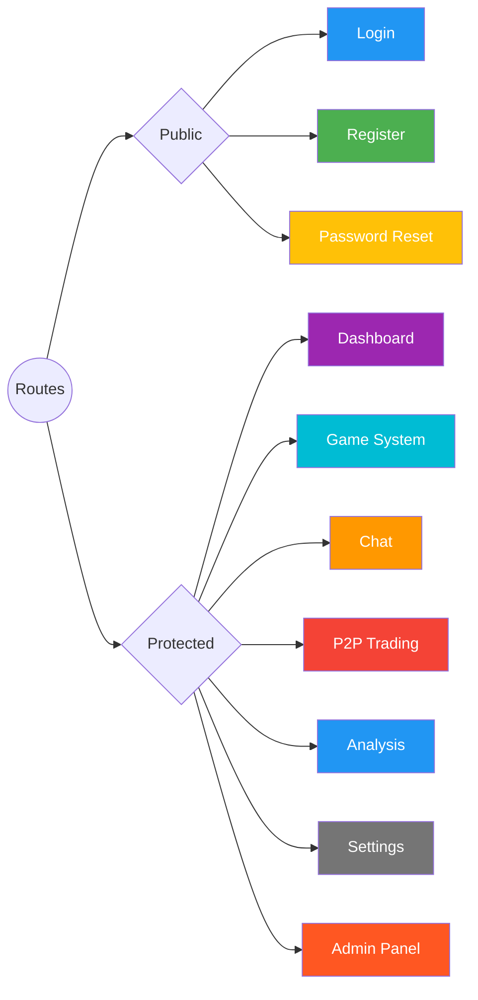
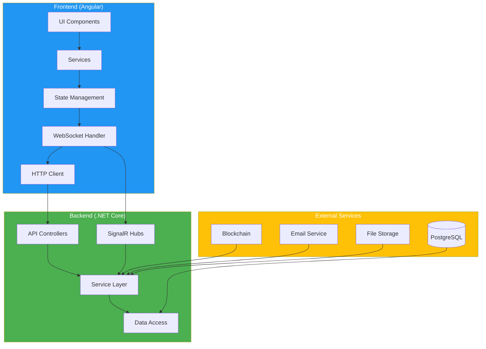
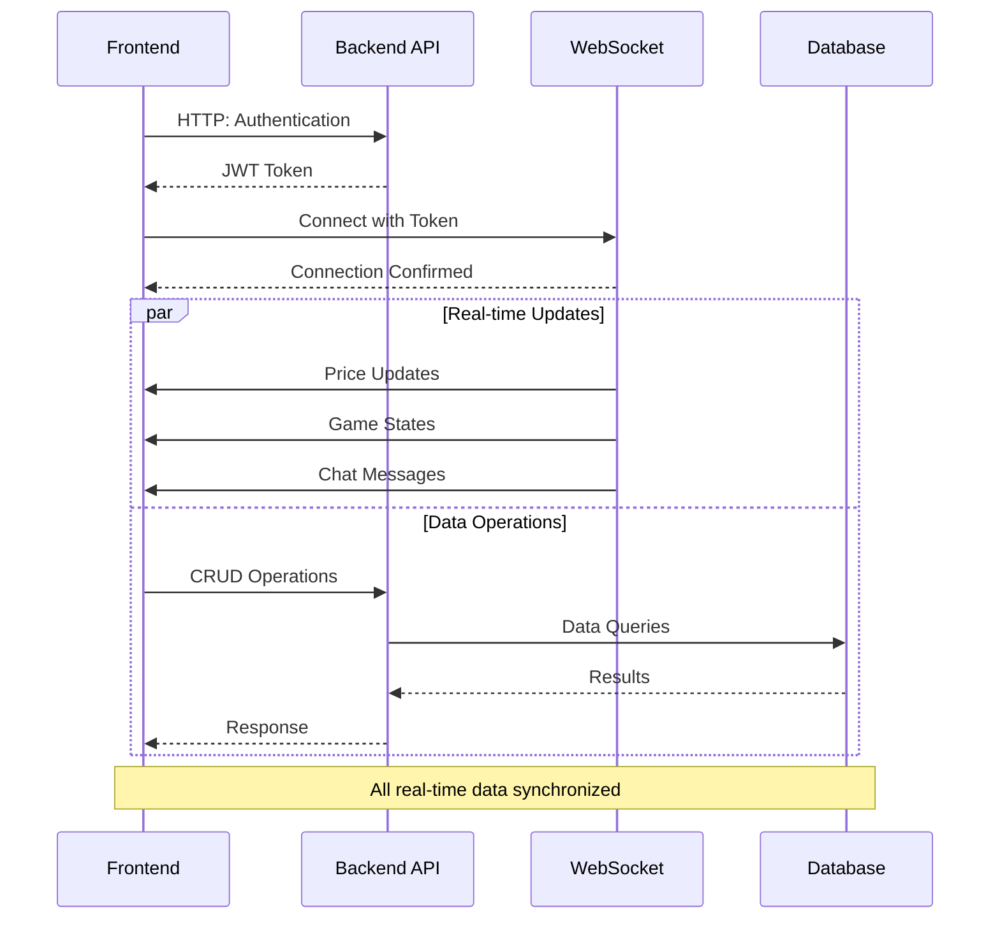

# DATK Platform: A Real-Time Trading & Communication System

## 1. Abstract

This repository contains the source code for the DATK Platform, a full-stack application engineered for real-time user interaction. The system integrates a sophisticated cryptocurrency-based bidding game, a comprehensive messaging platform, blockchain event logging, and advanced trading analytics. The architecture is designed around a service-oriented .NET backend and a reactive Angular single-page application (SPA), with a strong emphasis on real-time communication via WebSockets and automated trading strategies.

## 2. System Architecture

The application is built on a decoupled client-server model, ensuring a clean separation of concerns between the frontend presentation layer and the backend business logic.

### 2.1. Backend Architecture

The backend is a monolithic ASP.NET Core application structured using a multi-layer, service-oriented architecture.

- **API Layer**: A set of RESTful controllers (`Controllers/`) exposes the primary HTTP endpoints for all CRUD operations and user-driven actions (e.g., placing a bet, sending a message).
- **Service Layer**: The core business logic is encapsulated within services (`Services/`). This layer is responsible for orchestrating data from multiple sources, performing calculations, and handling the primary logic for features like game session management, user authentication, and chat operations.
- **Data Access Layer**: Data persistence is managed via Entity Framework Core, with a `TradeFinanceDbContext` (`Data/`) defining the object-relational mapping to a PostgreSQL database. This context includes all entities, from user models to game and transaction logs.
- **Real-time Subsystem**: SignalR hubs (`Hubs/`) provide the real-time communication backbone. Key hubs include:
    - `GameHub`: Broadcasts game state changes, price updates, and round results to all connected clients.
    - `ChatHub`: Manages real-time messaging, user presence, and typing indicators.
    - `PresenceHub`: Specifically tracks online status for users across the application.
- **Background Services**: The system utilizes `IHostedService` implementations for long-running background tasks, including the `GameSessionManagementService` (to control game rounds), `PMCoinBotService` (to simulate market volatility), and `DailyAnalysisScheduler` (for periodic notifications).

### 2.2. Frontend Architecture

The frontend is a modern Angular SPA designed for a dynamic and reactive user experience.

- **Component-Based UI**: The UI is built from a tree of modular Angular components (`features/` and `shared/`), promoting reusability and maintainability.
- **Reactive State Management**: RxJS is used extensively to manage asynchronous data streams from the backend, handle user input, and maintain UI state.
- **Service Layer**: Angular services (`core/services/`) are responsible for encapsulating all communication with the backend. This includes making HTTP requests to the REST API and managing the persistent SignalR connection.
- **Routing**: The application uses a feature-based routing module (`app.routes.ts`) with route guards (`AuthGuard`, `AdminGuard`) to protect application sections based on user authentication and authorization status.
- **Blockchain Interaction**: The frontend leverages the `ethers.js` library to interact directly with user wallets (like MetaMask) for signing transactions or messages, providing a bridge to client-side blockchain operations.

### 2.3. Application Routes and API Endpoints

#### 🌐 Client Routes



#### 📍 Route Details

| Route | Access | Features |
|-------|---------|----------|
| `/login` | Public | - User authentication<br>- Password recovery<br>- 2FA support |
| `/register` | Public | - Account creation<br>- Email verification<br>- Terms acceptance |
| `/dashboard` | Protected | - Overview stats<br>- Quick actions<br>- Notifications |
| `/game` | Protected | - Live trading<br>- Game rooms<br>- Leaderboard |
| `/chat` | Protected | - Direct messages<br>- Group chats<br>- File sharing |
| `/p2p` | Protected | - Order book<br>- Trade history<br>- Market stats |
| `/analysis` | Protected | - Market analysis<br>- Performance metrics<br>- Reports |
| `/settings` | Protected | - Profile settings<br>- Security options<br>- Preferences |
| `/admin` | Admin | - User management<br>- System monitoring<br>- Configuration |

#### 🔌 API Endpoints Overview

| Category | Endpoint | Method | Description | Auth Required | 
|:--------:|----------|--------|-------------|:------------:|
| 🔐 **Authentication** |
| | `/api/auth/login` | POST | User login | ❌ |
| | `/api/auth/register` | POST | New user registration | ❌ |
| | `/api/auth/refresh-token` | POST | Refresh JWT token | ✅ |
| 👤 **User Management** |
| | `/api/users/profile` | GET | Get user profile | ✅ |
| | `/api/users/profile` | PUT | Update profile | ✅ |
| | `/api/users/balance` | GET | Get user balance | ✅ |
| 🎮 **Game System** |
| | `/api/game/session` | GET | Current game session | ✅ |
| | `/api/game/bet` | POST | Place a bet | ✅ |
| | `/api/game/history` | GET | Game history | ✅ |
| 💬 **Chat System** |
| | `/api/chat/conversations` | GET | List conversations | ✅ |
| | `/api/chat/messages` | POST | Send message | ✅ |
| | `/api/chat/messages/{id}` | DELETE | Delete message | ✅ |
| 📈 **Trading & Analysis** |
| | `/api/p2p/price` | GET | Current PM coin price | ✅ |
| | `/api/p2p/orders` | POST | Create trade order | ✅ |
| | `/api/analysis/daily` | GET | Daily analysis | ✅ |
| 📂 **File Management** |
| | `/api/files/upload` | POST | Upload file | ✅ |
| | `/api/files/{id}` | GET | Get file | ✅ |
| ⚙️ **System Administration** |
| | `/api/admin/users` | GET | List all users | 👑 |
| | `/api/admin/logs` | GET | System logs | 👑 |

#### 🔄 System Architecture Diagram



#### 🔌 Integration Flow Diagram



#### 🎨 Color Scheme & Design System

```scss
// Primary Colors
$primary-blue: #2196F3;    // Main actions, buttons
$primary-green: #4CAF50;   // Success states
$primary-red: #F44336;     // Error states
$primary-yellow: #FFC107;  // Warning states

// Neutral Colors
$background-dark: #121212;   // Main background
$background-light: #1E1E1E;  // Cards, containers
$text-primary: #FFFFFF;      // Primary text
$text-secondary: #B0B0B0;    // Secondary text

// Accent Colors
$accent-purple: #9C27B0;   // Special features
$accent-cyan: #00BCD4;     // Highlights
$accent-orange: #FF9800;   // Notifications
```

## 3. Core Functionalities In-Depth

### 3.1. Real-Time Bidding Game

The game is a sophisticated, timed, binary-option bidding system with advanced trading features.

1. **Session Management**: 
   - The `GameSessionManagementService` initiates and manages game sessions at configurable intervals
   - Dynamic session timing based on market volatility
   - Automatic recovery and state management for system resilience

2. **Advanced Trading Features**:
   - Real-time price feeds from multiple sources
   - Advanced bot trading capabilities via `AdvancedBotTradingService`
   - AI-powered price prediction and trend analysis
   - Risk management and position sizing algorithms

3. **Game Mechanics**:
   - Multiple game modes (Binary Options, Price Prediction, Tournament)
   - Real-time price broadcasting through `GameHub`
   - Sophisticated betting system with various options
   - Advanced profit/loss calculation algorithms

4. **Analytics and Monitoring**:
   - Real-time bet distribution analysis
   - Automated risk assessment
   - Performance metrics and KPIs
   - Advanced reporting through `RealTimeBetAnalysisService`

5. **Safety Features**:
   - Automated circuit breakers for market volatility
   - Anti-manipulation detection systems
   - Fair play enforcement mechanisms
   - Real-time fraud detection

### 3.2. Messaging Platform

The chat system provides a rich, real-time communication experience.

- **Communication**: All messages are sent and received over the `ChatHub` WebSocket connection.
- **Features**: The platform supports one-on-one and group chats, user presence (online/offline status), read receipts, and typing indicators.
- **Data Persistence**: All messages and chat metadata are stored in the PostgreSQL database, allowing for the retrieval of chat history.

### 3.3. Blockchain Integration

The platform is designed to interface with an Ethereum-compatible blockchain.

- **Backend (Nethereum)**: The `SmartContractLogService` uses the Nethereum library to listen for specific events emitted by a designated smart contract. When an event is detected, the service logs the relevant data (transaction hash, addresses, amounts) into the `SmartContractLogs` table in the database.
- **Frontend (Ethers.js)**: The frontend uses `ethers.js` to prompt users for actions via their browser wallet (e.g., MetaMask), enabling client-side interaction with smart contracts.

## 4. Database Schema Overview

The PostgreSQL database schema is defined by EF Core and includes several key tables:

- **User Management**: `Users`, `UserProfiles`, `UserSessions`, `UserBalances`
- **Chat**: `Chats`, `ChatParticipants`, `Messages`, `MessageReads`
- **Game**: `CurrentGameSessions`, `ActiveBets`, `UserGameStats`, `ProfitAnalysis`
- **Transactions & History**: `TransactionHistories`, `BalanceTransactions`, `PMCoinPriceHistories`
- **Blockchain**: `SmartContractLogs`

Relationships are configured to maintain data integrity, such as cascading deletes for bets within a game session.

## 5. Security Model

- **Authentication**: The primary authentication strategy is session-based, managed by the custom `SessionAuthenticationMiddleware`. JWT support is also implemented but can be toggled.
- **Authorization**: Access to specific API endpoints and frontend routes is restricted using role-based access control (RBAC). The backend defines policies like `AdminOnly`, and the frontend uses `AdminGuard` to enforce this on the client-side.
- **Transport Security**: The application is configured to use HTTPS in production. A strict Content Security Policy (CSP) is enforced via middleware to prevent cross-site scripting (XSS) attacks.
- **CORS**: A Cross-Origin Resource Sharing (CORS) policy is configured to only allow requests from the known Angular frontend origin (`http://localhost:4200`).

## 6. Technology Stack

### Backend (.NET)

| Dependency | Version | Usage |
| :--- | :--- | :--- |
| **.NET** | 8.0 | Core Framework |
| **ASP.NET Core** | 8.0 | Web API & Application Host |
| **Entity Framework Core**| 8.0 | Object-Relational Mapper (ORM) |
| **Npgsql** | 8.0 | PostgreSQL Database Provider |
| **SignalR** | 1.2.0 | Real-time Web Functionality |
| **Nethereum** | 4.14.0 | Ethereum Blockchain Interaction |
| **JWT Bearer** | 8.0.0 | Authentication |
| **MailKit** | 4.7.1 | Email Services |
| **CloudinaryDotNet** | 1.27.6 | Cloud Media Management |
| **Swashbuckle** | 6.5.0 | API Documentation (Swagger) |
| **MediatR** | 12.0.0 | CQRS Pattern Implementation |
| **AutoMapper** | 12.0.0 | Object Mapping |
| **Quartz.NET** | 3.7.0 | Job Scheduling |
| **NLog** | 5.2.0 | Advanced Logging |

### Frontend (Angular)

| Dependency | Version | Usage |
| :--- | :--- | :--- |
| **Angular** | ~20.0.0 | Core Framework |
| **Angular Material** | ~20.1.0 | UI Component Library |
| **RxJS** | ~7.8.0 | Reactive Programming |
| **SignalR Client** | ~9.0.6 | Real-time WebSockets |
| **Ethers** | ~6.15.0 | Blockchain Interaction (Wallet) |
| **Lightweight Charts** | ~5.0.8 | High-performance Financial Charts |
| **Three.js** | ~0.165.0 | 3D Graphics Engine |
| **TailwindCSS** | ~3.3.0 | Utility-first CSS Framework |
| **NgRx** | ~16.0.0 | State Management |
| **Angular JWT** | ~10.0.0 | JWT Handling |

## 7. Setup and Deployment

### Prerequisites

- .NET 8 SDK
- Node.js and npm (LTS version)
- Angular CLI (`npm install -g @angular/cli`)
- A running PostgreSQL instance

### Backend Setup

1.  **Navigate to directory:** `cd Backend`
2.  **Configure connection:** Update `DefaultConnection` in `appsettings.Development.json`.
3.  **Restore dependencies:** `dotnet restore`
4.  **Apply migrations:** `dotnet ef database update`
5.  **Run server:** `dotnet run` (API will be on `http://localhost:5000`)

### Frontend Setup

1.  **Navigate to directory:** `cd client-angular`
2.  **Restore dependencies:** `npm install`
3.  **Run server:** `npm start` (UI will be on `http://localhost:4200`)
